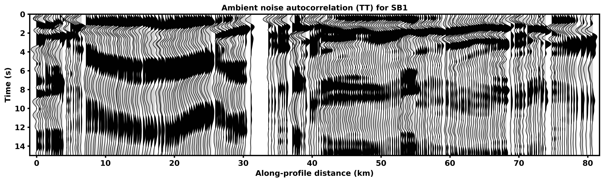
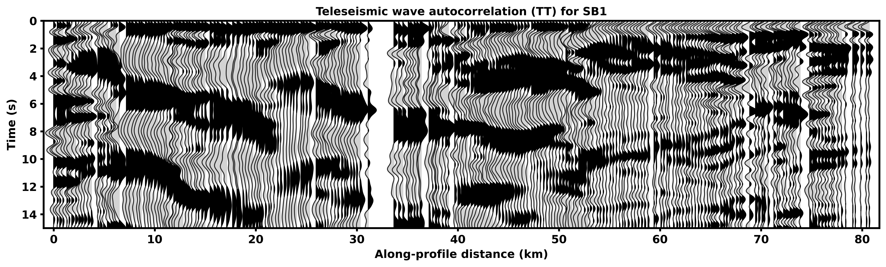

# BASIN_ACF

## Introduction
This repository provides code for the paper [Imaging the Northern Los Angeles Basins with Autocorrelations](
https://doi.org/10.1785/0220240140).

## File Description
- **noise_acf_TT_SB1.ipynb**: Workflow for ambient noise autocorrelation, taking Line SB1 as an example
- **earthquake_acf_TT_SB1.ipynb**: Workflow for teleseismic wave autocorrelation, taking Line SB1 as an example
- **noise_func.py**: Functions for use with noise_acf_TT_SB1.ipynb
- **earthquake_func.py**: Functions for use with earthquake_acf_TT_SB1.ipynb
- ***.npy**: Final autocorrelation functions
- ***.png**: Example images


## Dependencies
```
environment.yml
```

## Example Image



## Contact
We welcome any comments or questions regarding this work. If you find it helpful, please cite:
```
Caifeng Zou, Robert W. Clayton; Imaging the Northern Los Angeles Basins with Autocorrelations. Seismological Research Letters 2024; doi: https://doi.org/10.1785/0220240140
```

Caifeng Zou\
czou@caltech.edu

